# VisionSoC FPGA — Top-Level Abstract System Diagram

Bitstream reference: `mudkip2d128big1bram1chain2lanescale_fpga_maskopt-20260518-055430` (5t-maskopt).
Sources: `fpga/system/system_top.tcl`, `fpga/dts/system_top_wrapper.dts`,
`fyp_doc/2d_fabric_handoff.md`, `fyp_doc/fpga_build_status.md`,
`fpga/build/.../utilization_synth.rpt`.

Three concurrent traffic classes share the PS↔PL boundary:

1. **Control plane** (PS → PL CSRs) over `M_AXI_HPM0_FPD` (60 MHz) and `M_AXI_HPM0_LPD` (100 MHz)
2. **T1 + DMA data plane** (PL → DDR) over `S_AXI_HPC0_FPD` (128 b, 60 MHz) and `S_AXI_HP0_FPD` (32 b, 60 MHz)
3. **Camera video plane** (PL → DDR) over `S_AXI_HP1_FPD` (128 b, 300 MHz)

```mermaid
flowchart LR

  %% ============== External world ==============
  subgraph EXT["External (KV260 IAS daughtercard)"]
    direction TB
    AR1335["AR1335<br/>image sensor"]
    AP1302["AP1302 ISP<br/>(crop+downscale to 128x128, NV12)"]
    AR1335 -->|"raw Bayer<br/>parallel"| AP1302
  end

  %% ============== PS ==============
  subgraph PS["Zynq UltraScale+ PS (Cortex-A53 + DDR4)"]
    direction TB
    PS_DDR[("DDR4<br/>2 GB")]
    PS_CTRL["M_AXI_HPM0_FPD<br/>128 b @ 60 MHz<br/>(control plane, FPD)"]
    PS_LPD["M_AXI_HPM0_LPD<br/>128 b @ 100 MHz<br/>(control plane, LPD)"]
    PS_HPC0["S_AXI_HPC0_FPD<br/>128 b @ 60 MHz<br/>(T1 + DMA data)"]
    PS_HP0["S_AXI_HP0_FPD<br/>32 b @ 60 MHz<br/>(T1 idx)"]
    PS_HP1["S_AXI_HP1_FPD<br/>128 b @ 300 MHz<br/>(video write-back)"]
    PS_IRQ["pl_ps_irq0[5:0]<br/>(SPI 89..94)"]
    PS_EMIO["emio_gpio_o[1]<br/>(AP1302 reset)"]
    PS_CLK["pl_clk0 = 100 MHz"]
    PS_HPC0 --- PS_DDR
    PS_HP0  --- PS_DDR
    PS_HP1  --- PS_DDR
  end

  %% ============== PL: clock / reset ==============
  subgraph CLK["Clock + Reset (PL)"]
    direction LR
    CLKWIZ["clk_wiz_0<br/>60 / 100 / 200 / 300 MHz"]
    RST60["proc_sys_reset (60 MHz)"]
    RST100["proc_sys_reset_100M"]
    RST300["proc_sys_reset_300M"]
  end
  PS_CLK --> CLKWIZ
  CLKWIZ --> RST60
  CLKWIZ --> RST100
  CLKWIZ --> RST300

  %% ============== PL: T1 compute ==============
  subgraph T1["T1 vector compute (60 MHz)"]
    direction TB
    T1TOP["t1_fpga_top<br/>(T1 core + AXI-Lite wrapper)<br/>~83.7k LUT, 132 BRAM36"]
    T1CTRL["s_axi_ctrl @ 0xA000_0000<br/>(CSRs, IRQ)"]
    T1HB["m_axi_hb<br/>128 b master"]
    T1IDX["m_axi_idx<br/>32 b master"]
    T1TOP --- T1CTRL
    T1TOP --- T1HB
    T1TOP --- T1IDX
  end

  %% ============== PL: DMA + scratchpad ==============
  subgraph MEM["Scratchpad + DMA (60 MHz)"]
    direction TB
    URAM["axi_bram_ctrl + uram_scratchpad<br/>512 KB UltraRAM @ 0xA008_0000<br/>(16 URAM288 tiles)"]
    DMA["axi_dma 7.1<br/>(no SG, mm2s + s2mm,<br/>c_sg_length_width=23 → 8 MiB max)<br/>CSR @ 0xA001_0000"]
    DMA_LOOP["axis_reg_slice_dma<br/>(mm2s→s2mm loopback skid)"]
    DMA -- "M_AXIS_MM2S" --> DMA_LOOP
    DMA_LOOP -- "S_AXIS_S2MM" --> DMA
  end

  %% ============== PL: data-plane interconnect ==============
  subgraph DATAIC["Data-plane interconnect (60 MHz)"]
    direction TB
    SC_HB["smartconnect_hb<br/>3 SI × 2 MI<br/>(LOW_AREA)"]
    SC_IDX["smartconnect_idx<br/>1 SI × 1 MI"]
    REG_HB["axi_register_slice (15-deep)<br/>T1 hb → smartconnect_hb"]
  end

  %% ============== PL: control-plane interconnect ==============
  subgraph CTRLIC["Control-plane interconnect"]
    direction TB
    SC_CTRL["smartconnect_ctrl<br/>1 SI × 3 MI<br/>(FPD, 60 MHz)"]
    SC_LPD["smartconnect_lpd<br/>1 SI × 2 MI<br/>(LPD 100→300 MHz CDC)"]
  end

  %% ============== PL: camera pipeline ==============
  subgraph CAM["Camera pipeline (AXIS, 300 MHz video)"]
    direction LR
    CSI2["mipi_csi2_rx_subsystem<br/>4 lanes, 896 Mbps, DT=0x18<br/>ppc=1, CSR @ 0x8000_0000"]
    AXIS_RS["axis_register_slice<br/>(camera rate-match skid;<br/>was 256-deep FIFO until 5t)"]
    AXIS_CONV["axis_subset_converter<br/>2B → 3B (TDATA pad)"]
    FRMBUF["v_frmbuf_wr<br/>NV12, max 256×256<br/>CSR @ 0x8001_0000"]
    SC_VIDEO["smartconnect_video<br/>1 SI × 1 MI (300 MHz)"]
    CSI2 --> AXIS_RS --> AXIS_CONV --> FRMBUF
    FRMBUF -- "m_axi_mm_video" --> SC_VIDEO
  end

  %% ============== PL: sensor I2C ==============
  IIC["axi_iic (sensor_iic)<br/>400 kHz, CSR @ 0xA005_0000"]

  %% ============== PL: misc glue ==============
  subgraph GLUE["Glue"]
    direction TB
    IRQCAT["xlconcat<br/>(6 PL IRQs → pl_ps_irq0)"]
    RSTSLICE["xlslice<br/>emio_gpio_o[1] → ap1302_rst_b"]
    STBY["xlconstant 0<br/>→ ap1302_standby"]
  end

  %% ============== Top-level PL ports (to carrier) ==============
  MIPI_PORT(["mipi_phy_if<br/>(SOM240 connector)"])
  IIC_PORT(["iic<br/>(SOM240 connector)"])
  RST_PORT(["ap1302_rst_b"])
  STBY_PORT(["ap1302_standby"])

  %% ============== Wiring: control plane ==============
  PS_CTRL --> SC_CTRL
  SC_CTRL -->|"M00 → 0xA000_0000"| T1CTRL
  SC_CTRL -->|"M01 → 0xA001_0000"| DMA
  SC_CTRL -->|"M02 → 0xA005_0000"| IIC

  PS_LPD --> SC_LPD
  SC_LPD -->|"M00 → 0x8000_0000"| CSI2
  SC_LPD -->|"M01 → 0x8001_0000<br/>(100→300 MHz CDC)"| FRMBUF

  %% ============== Wiring: T1 + DMA data plane ==============
  T1HB --> REG_HB --> SC_HB
  DMA -->|"M_AXI_MM2S"| SC_HB
  DMA -->|"M_AXI_S2MM"| SC_HB
  SC_HB -->|"M00 → DDR<br/>(2 GB @ 0x0)"| PS_HPC0
  SC_HB -->|"M01 → URAM<br/>(512 KB @ 0xA008_0000)"| URAM

  T1IDX --> SC_IDX --> PS_HP0

  %% ============== Wiring: camera plane ==============
  AP1302 -.->|"MIPI CSI-2<br/>4 lanes"| MIPI_PORT
  MIPI_PORT --> CSI2
  SC_VIDEO --> PS_HP1
  IIC --> IIC_PORT -.->|"I²C 400 kHz"| AP1302

  %% ============== Wiring: AP1302 control/reset ==============
  PS_EMIO --> RSTSLICE --> RST_PORT -.-> AP1302
  STBY --> STBY_PORT -.-> AP1302

  %% ============== Wiring: IRQ aggregation ==============
  T1TOP    -- "irq"         --> IRQCAT
  DMA      -- "mm2s_introut" --> IRQCAT
  DMA      -- "s2mm_introut" --> IRQCAT
  IIC      -- "iic2intc_irpt" --> IRQCAT
  CSI2     -- "csirxss_csi_irq" --> IRQCAT
  FRMBUF   -- "interrupt"   --> IRQCAT
  IRQCAT --> PS_IRQ

  %% ============== Wiring: PS DisplayPort (separate path) ==============
  PS_DDR -.->|"PS DisplayPort<br/>(SoC-internal, not in PL)"| DP[/"DP → HDMI<br/>(carrier ext.)"/]

  %% ============== Styling ==============
  classDef ps fill:#dbe9ff,stroke:#3b6bd6,color:#0b234f;
  classDef pl_t1 fill:#fde2c4,stroke:#d4880a,color:#3a1f00;
  classDef pl_mem fill:#dff5d8,stroke:#3a9a3a,color:#0b3a0b;
  classDef pl_cam fill:#f7d1e7,stroke:#b94a8b,color:#3a0726;
  classDef pl_ic fill:#eee2fb,stroke:#7a4ab3,color:#260a4a;
  classDef pl_glue fill:#f4f4f4,stroke:#888,color:#222;
  classDef ext fill:#fff5b8,stroke:#a98a13,color:#3a2b00;
  classDef port fill:#ffffff,stroke:#444,stroke-dasharray: 4 3,color:#222;

  class PS,PS_DDR,PS_CTRL,PS_LPD,PS_HPC0,PS_HP0,PS_HP1,PS_IRQ,PS_EMIO,PS_CLK ps;
  class T1,T1TOP,T1CTRL,T1HB,T1IDX pl_t1;
  class MEM,URAM,DMA,DMA_LOOP pl_mem;
  class CAM,CSI2,AXIS_RS,AXIS_CONV,FRMBUF,SC_VIDEO pl_cam;
  class DATAIC,CTRLIC,SC_HB,SC_IDX,SC_CTRL,SC_LPD,REG_HB pl_ic;
  class CLK,CLKWIZ,RST60,RST100,RST300,GLUE,IRQCAT,RSTSLICE,STBY,IIC pl_glue;
  class EXT,AR1335,AP1302,DP ext;
  class MIPI_PORT,IIC_PORT,RST_PORT,STBY_PORT port;
```

## Legend

| Colour | Meaning |
|---|---|
| Blue | Zynq UltraScale+ PS (Cortex-A53, DDR, AXI master/slave ports, EMIO, IRQ) |
| Orange | T1 vector compute core (PL) |
| Green | Scratchpad memory + DMA |
| Pink | Camera pipeline (MIPI → AXIS → frame buffer writer) |
| Purple | AXI SmartConnects and register slices |
| Grey | Clocking, reset, IRQ glue |
| Yellow | External (off-FPGA) components on the IAS daughtercard |
| Dashed boxes | Top-level PL ports going to the SOM240 / KV260 carrier |

## Address map (top-level abstract)

| Window | Base | Size | Reached via |
|---|---|---:|---|
| T1 AXI-Lite CSRs | `0xA000_0000` | 64 KB | `M_AXI_HPM0_FPD` → `smartconnect_ctrl/M00` |
| `axi_dma` CSRs | `0xA001_0000` | 64 KB | `M_AXI_HPM0_FPD` → `smartconnect_ctrl/M01` |
| `sensor_iic` CSRs | `0xA005_0000` | 64 KB | `M_AXI_HPM0_FPD` → `smartconnect_ctrl/M02` |
| URAM scratchpad | `0xA008_0000` | 512 KB | T1 hb / DMA → `smartconnect_hb/M01` |
| `mipi_csi2_rx` CSRs | `0x8000_0000` | 64 KB | `M_AXI_HPM0_LPD` → `smartconnect_lpd/M00` |
| `v_frmbuf_wr` CSRs | `0x8001_0000` | 64 KB | `M_AXI_HPM0_LPD` → `smartconnect_lpd/M01` |
| DDR (T1 hb / DMA) | `0x0000_0000` | 2 GB | `smartconnect_hb/M00` → `S_AXI_HPC0_FPD` |
| DDR (T1 idx) | `0x0000_0000` | 2 GB | `smartconnect_idx/M00` → `S_AXI_HP0_FPD` |
| DDR (frmbuf video) | `0x0000_0000` | 2 GB | `smartconnect_video/M00` → `S_AXI_HP1_FPD` |

## Resource summary (synth report)

System total: **104,717 LUT / 108,017 FF / 143 RAMB36 + 2 RAMB18 / 16 URAM288** on
`xck26-sfvc784-2LV-c`. WNS +0.239 ns, WHS +0.010 ns.

Per top-level IP (synth):

| Instance | LUT | FF | RAMB36 | RAMB18 | URAM |
|---|---:|---:|---:|---:|---:|
| `t1_top` | 83,692 | 79,761 | 132 | 0 | 0 |
| `smartconnect_hb` | 5,966 | 9,103 | 0 | 0 | 0 |
| `mipi_csi2_rx` | 4,386 | 6,096 | 5 | 0 | 0 |
| `axi_dma` | 2,014 | 2,692 | 4 | 2 | 0 |
| `v_frmbuf_wr` | 1,905 | 2,364 | 2 | 0 | 0 |
| `bram_ctrl` | 1,285 | 327 | 0 | 0 | 0 |
| `smartconnect_idx` | 1,281 | 1,246 | 0 | 0 | 0 |
| `smartconnect_lpd` | 1,089 | 2,484 | 0 | 0 | 0 |
| `smartconnect_ctrl` | 1,038 | 1,102 | 0 | 0 | 0 |
| `smartconnect_video` | 763 | 831 | 0 | 0 | 0 |
| `axi_reg_slice_hb` | 547 | 1,260 | 0 | 0 | 0 |
| `sensor_iic` | 383 | 363 | 0 | 0 | 0 |
| `zynq_ps` (PL glue logic) | 266 | 0 | 0 | 0 | 0 |
| `axis_reg_slice_dma` | 24 | 79 | 0 | 0 | 0 |
| `axis_data_fifo_cap`¹ | 20 | 61 | 0 | 0 | 0 |
| `bram` (URAM wrapper) | 0 | 128 | 0 | 0 | 16 |

¹ Cell name preserved; the actual IP since 2026-05-18 is a 1-deep `axis_register_slice`,
not a 256-deep `axis_data_fifo` (frees 1 BRAM18 tile for the maskopt build).
