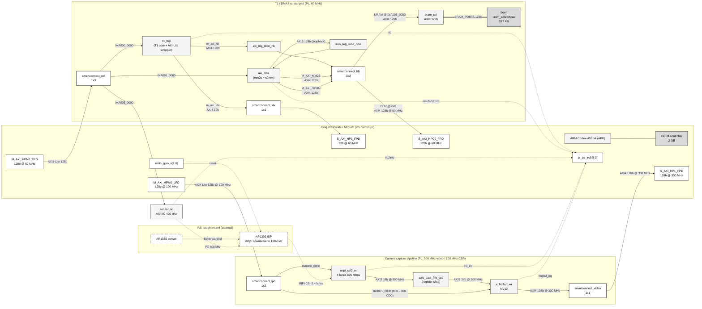

# VisionSoC FPGA — RTL Block Diagram (ARM TRM style)

Companion to `fpga_system_top_abstract.md`. Same bitstream
(`mudkip2d128big1bram1chain2lanescale_fpga_maskopt-20260518-055430`,
5t-maskopt). This view follows the convention of an ARM Technical Reference
Manual block diagram: monochrome rectangles, nested module boundaries,
labelled buses with widths and clocks, and explicit separation of
**data path**, **control path**, and **memory interfaces**.

The hardware shown is restricted to the first layer of the synthesis
hierarchy report (`utilization_synth.rpt`, level = direct children of
`system_top_i`) — 16 cells — plus the off-chip camera hardware
(AR1335 + AP1302) and the ARM Cortex-A53 cluster inside the PS.

Companion files in this folder:
- `fpga_system_top_rtl.drawio` — open in <https://app.diagrams.net> or the desktop draw.io app
- `fpga_system_top_abstract.md` — colour-coded high-level overview (previous diagram)

---

## 1. Design hierarchy

```
system_top_wrapper                                                      (HDL top)
└── system_top_i : system_top                                           (block design)
    │
    ├── zynq_ps              : Zynq UltraScale+ MPSoC (PS hard logic)
    │                          └── ARM Cortex-A53 ×4 + DDR4 ctrl + AXI ports + EMIO
    │
    ├── t1_top               : t1_fpga_top  — T1 vector core + AXI-Lite CSR wrapper
    │
    ├── axi_reg_slice_hb     : AXI4 register slice on T1 hb master  (timing isolation)
    ├── axi_dma              : Xilinx AXI DMA 7.1                    (mm2s + s2mm)
    ├── axis_reg_slice_dma   : AXIS register slice  (mm2s→s2mm loopback skid)
    │
    ├── bram_ctrl            : axi_bram_ctrl 4.1                     (AXI4 ↔ BRAM_PORTA)
    ├── bram                 : uram_scratchpad  (XPM SPRAM, ultra prim., 512 KB)
    │
    ├── smartconnect_ctrl    : AXI SmartConnect 1×3   (FPD CSR @ 60 MHz)
    ├── smartconnect_lpd     : AXI SmartConnect 1×2   (LPD CSR, 100→300 MHz CDC)
    ├── smartconnect_hb      : AXI SmartConnect 3×2   (T1 hb + DMA × 2 ⇒ DDR + URAM)
    ├── smartconnect_idx     : AXI SmartConnect 1×1   (T1 idx ⇒ HP0)
    ├── smartconnect_video   : AXI SmartConnect 1×1   (frmbuf ⇒ HP1 @ 300 MHz)
    │
    ├── sensor_iic           : Xilinx AXI IIC 2.1                    (400 kHz)
    │
    ├── mipi_csi2_rx         : Xilinx MIPI CSI-2 RX Subsystem        (4 lanes 896 Mbps)
    ├── axis_data_fifo_cap   : axis_register_slice  (1-deep camera skid)¹
    └── v_frmbuf_wr          : Xilinx Video Frame Buffer Writer      (NV12, ≤ 256×256)
```

¹ Cell name is historical (was a 256-deep `axis_data_fifo` until 2026-05-18; swapped for a 1-deep `axis_register_slice` in 5t-maskopt to free a BRAM18 tile). BD edge labels still read "axis_data_fifo_cap".

**Glue cells collapsed by Vivado (0 LUT, absent from `utilization_synth.rpt`'s hierarchical listing — therefore omitted from the diagram body, listed here for completeness):**
`clk_wiz_0`, `proc_sys_reset`, `proc_sys_reset_100M`, `proc_sys_reset_300M`,
`irq_concat` (`xlconcat`), `ap1302_rst_slice` (`xlslice`),
`ap1302_standby_const` (`xlconstant`), and `axis_subset_converter_cap`
(the 2 B → 3 B TDATA padder between `axis_data_fifo_cap` and `v_frmbuf_wr`;
becomes wires under Vivado's pad-with-constant optimisation).

---

## 2. Block-diagram layout description

Five module boundaries (nested rectangles), arranged so each bus class
flows in one direction:

```
+-------------------------+   +-----------------------------------------------------------+
| PS  (Zynq UltraScale+)  |   |  Camera capture pipeline   (300 MHz video + 100 MHz CSR)  |
|                         |   |    smartconnect_lpd ─ mipi_csi2_rx ─ axis_data_fifo_cap   |
|  ARM Cortex-A53 x4      |   |    ──────────────── v_frmbuf_wr ─ smartconnect_video      |
|  DDR4 (2 GB)            |   +-----------------------------------------------------------+
|                         |
|  M_AXI_HPM0_FPD  100 MHz|   +-----------------------------------------------------------+
|  M_AXI_HPM0_LPD  100 MHz|   |  T1 / DMA / scratchpad     (60 MHz data + control)        |
|                         |   |    smartconnect_ctrl ─ axi_reg_slice_hb ─ t1_top          |
|  S_AXI_HPC0_FPD  60 MHz |   |                         axi_dma + axis_reg_slice_dma     |
|  S_AXI_HP0_FPD   60 MHz |   |                         smartconnect_hb ─ bram_ctrl ─ URAM|
|  S_AXI_HP1_FPD  300 MHz |   |                         smartconnect_idx                  |
|                         |   +-----------------------------------------------------------+
|  pl_ps_irq0[5:0]        |
|  emio_gpio_o[1:0]       |   +---------------------+      +----------------------------+
|  pl_clk0  (100 MHz out) |   | sensor_iic (control)|      | IAS daughtercard (ext.)    |
+-------------------------+   +---------------------+      |   AP1302 ISP, AR1335 sens. |
                                                            +----------------------------+
```

**Three traffic classes** are drawn with distinct line weights / styles in the draw.io view:

| Class | Style | Examples |
|---|---|---|
| **Control path** (AXI4-Lite CSR) | thin grey line | PS HPM0_FPD → T1 CSR; PS HPM0_LPD → MIPI CSR |
| **Data path** (AXI4 burst memory) | thick black line | T1 hb → DDR; frmbuf → DDR; DMA → URAM |
| **Memory interface** (BRAM port / on-chip) | thick double line | `bram_ctrl` → URAM scratchpad |
| **AXIS streaming** | thick black line | camera CSI → frmbuf |
| **IRQ / GPIO sideband** | dashed grey | sensor IRQs → `pl_ps_irq0`; EMIO → AP1302 reset |
| **MIPI / I²C / external** | dashed thin black | AP1302 ↔ MIPI; sensor_iic ↔ AP1302 |

Each edge is annotated with `<protocol> <data_width> @ <clock>`
(e.g. `AXI4 128b @ 60 MHz`). Address windows are written on the master-port-side
of the control edges (e.g. `0xA000_0000` on the `smartconnect_ctrl → t1_top` edge).

---

## 3. Mermaid quick-preview

This is a quick-look render (Mermaid can't replicate the full TRM layout
precisely, but it gets the hierarchy and bus labels across). For the
print-quality version use the `.drawio` file.



---

## 4. draw.io block list and connections

The `.drawio` file in this folder uses the listing below. If you'd rather
rebuild or re-style it by hand, every block and edge is enumerated here.

### 4.1 Module boundaries (containers)

| ID | Label | x | y | w | h |
|---|---|---:|---:|---:|---:|
| `c_ps`     | Zynq UltraScale+ MPSoC (PS hard logic)         |   20 |  20 |  240 | 660 |
| `c_cam`    | Camera capture pipeline (PL, 300 MHz video)    |  290 |  20 |  900 | 230 |
| `c_cmp`    | T1 / DMA / scratchpad (PL, 60 MHz)             |  290 | 270 |  900 | 320 |
| `c_iic`    | Sensor control (PL, 60 MHz)                    |  290 | 610 |  900 |  70 |
| `c_ext`    | IAS daughtercard (external)                    | 1210 |  20 |  220 | 230 |

### 4.2 Leaf blocks (only synth-report first-layer cells + ARM core + DDR + ports)

| ID | Label | Container | x | y | w | h |
|---|---|---|---:|---:|---:|---:|
| `arm`        | ARM Cortex-A53 ×4 (APU)                          | c_ps | 35 | 55 | 210 | 60 |
| `ddr`        | DDR4 controller (2 GB)                           | c_ps | 35 | 125 | 210 | 50 |
| `p_hpmf`     | M_AXI_HPM0_FPD  128b @ 60 MHz                    | c_ps | 35 | 195 | 210 | 30 |
| `p_hpml`     | M_AXI_HPM0_LPD  128b @ 100 MHz                   | c_ps | 35 | 230 | 210 | 30 |
| `p_hpc0`     | S_AXI_HPC0_FPD  128b @ 60 MHz                    | c_ps | 35 | 280 | 210 | 30 |
| `p_hp0`      | S_AXI_HP0_FPD   32b @ 60 MHz                     | c_ps | 35 | 315 | 210 | 30 |
| `p_hp1`      | S_AXI_HP1_FPD   128b @ 300 MHz                   | c_ps | 35 | 350 | 210 | 30 |
| `p_irq`      | pl_ps_irq0[5:0]                                  | c_ps | 35 | 405 | 210 | 30 |
| `p_emio`     | emio_gpio_o[1:0]                                 | c_ps | 35 | 440 | 210 | 30 |
| `p_pclk`     | pl_clk0 (100 MHz)                                | c_ps | 35 | 475 | 210 | 30 |
| `sc_lpd`     | smartconnect_lpd (1×2, 100→300 CDC)              | c_cam | 305 | 90 | 130 | 100 |
| `csi2`       | mipi_csi2_rx (4 lanes, 896 Mbps)                 | c_cam | 460 | 90 | 160 | 100 |
| `skid_cam`   | axis_data_fifo_cap (axis_register_slice, 1-deep) | c_cam | 645 | 110 | 140 | 60 |
| `frmbuf`     | v_frmbuf_wr (NV12, ≤256×256)                     | c_cam | 810 | 90 | 160 | 100 |
| `sc_vid`     | smartconnect_video (1×1)                         | c_cam | 995 | 90 | 130 | 100 |
| `sc_ctrl`    | smartconnect_ctrl (1×3)                          | c_cmp | 305 | 360 | 130 | 100 |
| `reg_hb`     | axi_reg_slice_hb                                  | c_cmp | 460 | 305 | 140 | 50 |
| `t1`         | t1_top (T1 vector core + AXI-Lite wrapper)       | c_cmp | 460 | 370 | 160 | 180 |
| `dma`        | axi_dma (mm2s + s2mm)                            | c_cmp | 640 | 295 | 160 | 100 |
| `reg_dma`    | axis_reg_slice_dma (mm2s→s2mm skid)              | c_cmp | 640 | 405 | 160 | 40 |
| `sc_hb`      | smartconnect_hb (3×2)                            | c_cmp | 820 | 295 | 130 | 160 |
| `sc_idx`     | smartconnect_idx (1×1)                           | c_cmp | 820 | 470 | 130 | 50 |
| `bram_ctrl`  | bram_ctrl (axi_bram_ctrl, 128b)                  | c_cmp | 970 | 295 | 160 | 50 |
| `uram`       | bram (uram_scratchpad, 512 KB)                   | c_cmp | 970 | 355 | 160 | 50 |
| `iic`        | sensor_iic (AXI IIC, 400 kHz)                    | c_iic | 460 | 625 | 160 | 50 |
| `ap1302`     | AP1302 ISP (crop+downscale to 128×128)           | c_ext | 1220 | 60 | 200 | 80 |
| `ar1335`     | AR1335 sensor                                    | c_ext | 1220 | 155 | 200 | 60 |

Block style (TRM convention):

- Compute / IP block: white-fill, 1 px black border, sans-serif label
- Memory block: grey (#D9D9D9) fill, 1 px black border, double-line right edge
- SmartConnect: white-fill, 1.5 px black border
- PS port: white-fill, 1 px black border (PS subsystem boundary is the 2 px container)
- External: white-fill, 1 px dashed black border

### 4.3 Bus connections (edges)

Notation: `src` → `dst`  | bus type | label.

| # | Class | Source | Target | Label |
|---:|---|---|---|---|
| 1 | Control | `p_hpmf`   | `sc_ctrl`    | AXI4-Lite 128b @ 60 MHz |
| 2 | Control | `sc_ctrl`  | `t1`         | AXI4-Lite (CSR) @ 0xA000_0000 |
| 3 | Control | `sc_ctrl`  | `dma`        | AXI4-Lite (CSR) @ 0xA001_0000 |
| 4 | Control | `sc_ctrl`  | `iic`        | AXI4-Lite (CSR) @ 0xA005_0000 |
| 5 | Control | `p_hpml`   | `sc_lpd`     | AXI4-Lite 128b @ 100 MHz |
| 6 | Control | `sc_lpd`   | `csi2`       | AXI4-Lite (CSR) @ 0x8000_0000 |
| 7 | Control | `sc_lpd`   | `frmbuf`    | AXI4-Lite (CSR) @ 0x8001_0000 (100→300 MHz CDC) |
| 8 | Data    | `t1`       | `reg_hb`    | m_axi_hb  AXI4 128b @ 60 MHz |
| 9 | Data    | `reg_hb`   | `sc_hb`     | AXI4 128b |
| 10 | Data    | `dma`     | `sc_hb`     | M_AXI_MM2S  AXI4 128b |
| 11 | Data    | `dma`     | `sc_hb`     | M_AXI_S2MM  AXI4 128b |
| 12 | Data    | `sc_hb`   | `p_hpc0`    | AXI4 128b @ 60 MHz  →  DDR (0x0, 2 GB) |
| 13 | Data    | `sc_hb`   | `bram_ctrl` | AXI4 128b           →  URAM (0xA008_0000, 512 KB) |
| 14 | Memory  | `bram_ctrl`| `uram`     | BRAM_PORTA 128b |
| 15 | Data    | `t1`       | `sc_idx`    | m_axi_idx  AXI4 32b |
| 16 | Data    | `sc_idx`   | `p_hp0`     | AXI4 32b @ 60 MHz  →  DDR (0x0, 2 GB) |
| 17 | AXIS    | `dma`     | `reg_dma`   | M_AXIS_MM2S 128b (loopback) |
| 18 | AXIS    | `reg_dma` | `dma`       | S_AXIS_S2MM 128b (loopback) |
| 19 | AXIS    | `csi2`    | `skid_cam`  | video_out  AXIS 16b @ 300 MHz |
| 20 | AXIS    | `skid_cam`| `frmbuf`    | s_axis_video  AXIS 24b (subset_conv padded)¹ |
| 21 | Data    | `frmbuf`  | `sc_vid`    | m_axi_mm_video  AXI4 128b @ 300 MHz |
| 22 | Data    | `sc_vid`  | `p_hp1`     | AXI4 128b @ 300 MHz  →  DDR (0x0, 2 GB) |
| 23 | External | `ar1335` | `ap1302`    | Bayer (parallel) |
| 24 | MIPI    | `ap1302`   | `csi2`      | MIPI CSI-2  4 lanes @ 896 Mbps |
| 25 | I²C     | `iic`      | `ap1302`    | I²C  400 kHz |
| 26 | GPIO    | `p_emio`   | `ap1302`    | emio_gpio_o[1]  →  ap1302_rst_b² |
| 27 | IRQ     | `t1`       | `p_irq`     | irq |
| 28 | IRQ     | `dma`      | `p_irq`     | mm2s_introut / s2mm_introut |
| 29 | IRQ     | `iic`      | `p_irq`     | iic2intc_irpt |
| 30 | IRQ     | `csi2`     | `p_irq`     | csirxss_csi_irq |
| 31 | IRQ     | `frmbuf`  | `p_irq`     | interrupt |
| 32 | Clock   | `p_pclk`   | (c_cam, c_cmp containers) | pl_clk0 100 MHz →  clk_wiz_0³ |

¹ `axis_subset_converter_cap` (2 B → 3 B TDATA pad) is logically between `skid_cam` and `frmbuf` but is absent from the synth report (collapsed to wires).
² `ap1302_rst_slice` (`xlslice`, `DIN_FROM=1 DIN_TO=1`) is also collapsed.
³ `clk_wiz_0` and the three `proc_sys_reset`s are likewise absent from the synth report.

---

## 5. How to open / edit

- **Web:** drag-and-drop `fpga_system_top_rtl.drawio` onto <https://app.diagrams.net>.
- **Desktop:** install <https://github.com/jgraph/drawio-desktop/releases> and `File → Open`.
- **VS Code:** the Hediet "Draw.io Integration" extension renders `.drawio` files inline.

Export from draw.io to PDF / SVG / PNG via *File → Export As*. SVG keeps text editable; PDF is the cleanest target for the FYP write-up.
