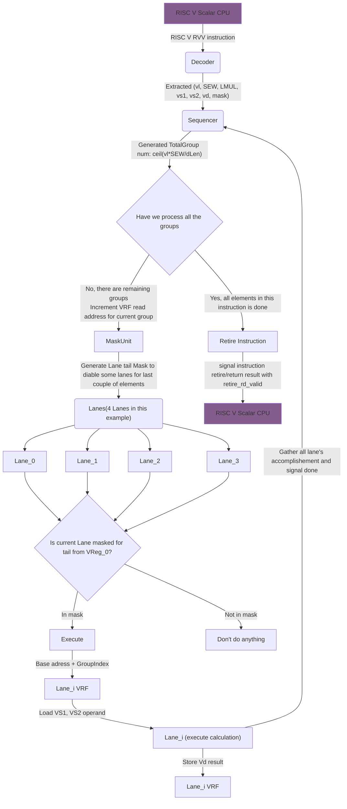
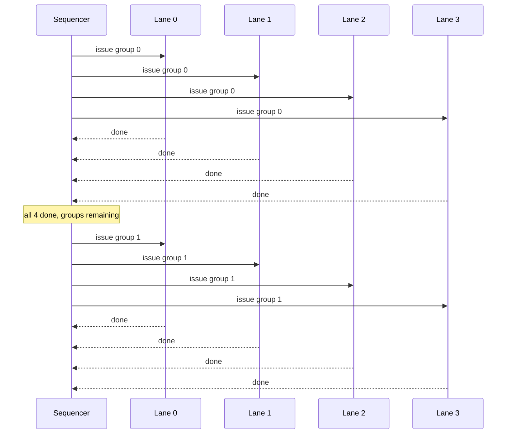

## System Architecture
### T1 
The T1 system is designed to process RISC V RVV instructions.

The T1 system consists of the following components:

- **Decoder**
- **Sequencer**
- **MaskUnit**
- **Lanes**
- **VRF(Vector Register File)**
- **LSU(LoadStore Unit)**

### Sequential flow of T1 system from the perspective of a logical operation instruction:



### Details on Sequencer and Lanes interaction

Each lane signals completion of its group back to the sequencer. The sequencer tracks whether all lanes have finished the current group, then decides:

  - More groups remaining -> increment group index, generate next VRF addresses, issue next group to the lanes
  - Last group done -> fire the retire signal

  The important detail is that all 4 lanes process the same group in lockstep. They all start together and all must finish before the sequencer advances. A lane might finish earlier than another (e.g. one lane's elements are masked off), but the sequencer waits for all lanes to report done before moving on.

Below diagram illustrates the case of chainingSize = 1

  With chaining (chainingSize >= 2), this gets more nuanced. The sequencer doesn't have to wait for a group's writeback to complete before issuing the next instruction's read of an earlier group. 
  But with chainingSize = 1, a single instruction is executed sequentially group-by-group.

### Sequentual flow of T1 system from the perspective of a load/store instruction:
Below is the flow for a unit-stride vector load (```VLE32.V vd, (rs1)```):

```mermaid
flowchart TB
    A["RISC-V Scalar CPU"] -- "instruction + rs1(base address)" --> B("Decoder")
    B -- "Decoded: load, vl, SEW, LMUL, vd, rs1_data, mask" --> SEQ["Sequencer"]

    SEQ -- "Generate mask (v0 + tail) for current group" --> MASK["Combined Mask"]
    SEQ -- "Group request + VRF write addr + mask" --> LANES["Lanes (4 Lanes)"]

    LANES --> L0["Lane 0<br>LSU"] & L1["Lane 1<br>LSU"] & L2["Lane 2<br>LSU"] & L3["Lane 3<br>LSU"]

    L0 -- "addr = rs1 + (group*4+0)*SEW/8 (mem address in bytes, hence /8)" --> ADDR_GEN["Address Generation<br>(per lane, per element)"]
    L1 -- "addr = rs1 + (group*4+1)*SEW/8" --> ADDR_GEN
    L2 -- "addr = rs1 + (group*4+2)*SEW/8" --> ADDR_GEN
    L3 -- "addr = rs1 + (group*4+3)*SEW/8" --> ADDR_GEN

    ADDR_GEN -- "Unit-stride:<br>consecutive addresses<br>merged into burst" --> PORT_SEL{"Which AXI port?"}

    PORT_SEL -- "Unit-stride / strided<br>(sequential/regular pattern)<br>128-bit wide bus" --> HB["highBandwidth<br>AXI4 Master Port"]
    PORT_SEL -- "Indexed (gather/scatter)<br>(irregular pattern)<br>32-bit wide bus" --> IDX["indexed<br>AXI4 Master Port"]

    HB --> ARB["AXI Round-Robin<br>Arbiter<br>(merges requests<br>from multiple rows)"]
    IDX --> ARB

    ARB -- "AXI read request<br>(ARADDR, ARLEN, ARSIZE)" --> SC["SmartConnect(FPGA Component)"]
    SC -- "AXI read request" --> DDR["PS DDR Memory<br>(FPGA Component)"]

    DDR -- "AXI read response<br>(RDATA, 128-bit)" --> SC
    SC --> ARB
    ARB -- "Route response<br>back to requesting row/lane<br>(using AXI ID)" --> DEMUX["Response Demux<br>(AXI ID encodes<br>source + row)"]

    DEMUX -- "32-bit element data" --> WB_L0["Lane 0: Write to VRF<br>vd[31:0]"]
    DEMUX -- "32-bit element data" --> WB_L1["Lane 1: Write to VRF<br>vd[63:32]"]
    DEMUX -- "32-bit element data" --> WB_L2["Lane 2: Write to VRF<br>vd[95:64]"]
    DEMUX -- "32-bit element data" --> WB_L3["Lane 3: Write to VRF<br>vd[127:96]"]

    WB_L0 & WB_L1 & WB_L2 & WB_L3 -- "All lanes done<br>for this group" --> SEQ

    SEQ --> CHECK{"All groups<br>processed?"}
    CHECK -- "No, increment group index<br>generate next addresses" --> SEQ
    CHECK -- "Yes" --> RETIRE["Retire Instruction"]
    RETIRE -- "retire_mem_valid pulse" --> A2["RISC-V Scalar CPU"]

    style A fill:#855d8d
    style A2 fill:#855d8d
    style HB fill:#2d6a4f
    style IDX fill:#2d6a4f
    style DDR fill:#1a3a5c
```


### Details on Lane and VRF architecture:
Key terminology:
 - **vLen**: vecotr length, how many bits are in the one vector register 
 - **dLen**: data lenght, how many bits are processed in parallel in one group or "cycle"
 - **datapathWidth**: how many bit are processed in parallel in ONE lane
 - **rowWidth**: how many bits are in one row of the VRF per lane. One VRF could have muliple bank, hence a wider rowWidth for this lane
 - **LMUL**: vector register grouping factor, a runtime configuration to determine how many vector registers are grouped together to form a wider effective vector register. This affects how the VRF is organized and how the lanes access the data.
  LMUL = 4 means 4 vector registers are grouped together. 32 vector registers/4 grouping = 8, there will be 8 architectural vector registers left(each are 4 times wider now to process more elements with same amount of hardware)
 - **vrfBankSize**: the more banking, more parallel read write access
 - **vrfRamType**: r(read), w(write), rw means memory is a dual port ram
 - **SEW**: Selected Element Width, how many bits in one element, this is determined by the instruction and affects how many elements are processed in one group

With current config for 2D T1 (vLen=128, dLen=128, datapathWidth=32, vrfBankSize=2, vrfRamType=p0rw) 
VRF Structure Per Lane:

  laneNumber = dLen / 32 = 4 lanes
  singleGroupSize = vLen / datapathWidth / laneNumber = 128 / 32 / 4 = 1
  rfDepth = vLen * 32 / rowWidth / laneNumber = 128 * 32 / 64 / 4 = 16
  rfBankNum = 2 (= vrfBankSize)

  Each lane has 2 banks, each bank is 16 entries deep * 32 bits wide

#### Lane 0 
bits [31:0] of every vector register, bank 0 holds even indexed registers, bank 1 holds odd indexed registers

| Bank 0 entry | Register     | Bank 1 entry | Register     |
|:------------:|:------------:|:------------:|:------------:|
| [0]          | v0  [31:0]   | [0]          | v1  [31:0]   |
| [1]          | v2  [31:0]   | [1]          | v3  [31:0]   |
| [2]          | v4  [31:0]   | [2]          | v5  [31:0]   |
| [3]          | v6  [31:0]   | [3]          | v7  [31:0]   |
| [4]          | v8  [31:0]   | [4]          | v9  [31:0]   |
| [5]          | v10 [31:0]   | [5]          | v11 [31:0]   |
| [6]          | v12 [31:0]   | [6]          | v13 [31:0]   |
| [7]          | v14 [31:0]   | [7]          | v15 [31:0]   |
| [8]          | v16 [31:0]   | [8]          | v17 [31:0]   |
| [9]          | v18 [31:0]   | [9]          | v19 [31:0]   |
| [10]         | v20 [31:0]   | [10]         | v21 [31:0]   |
| [11]         | v22 [31:0]   | [11]         | v23 [31:0]   |
| [12]         | v24 [31:0]   | [12]         | v25 [31:0]   |
| [13]         | v26 [31:0]   | [13]         | v27 [31:0]   |
| [14]         | v28 [31:0]   | [14]         | v29 [31:0]   |
| [15]         | v30 [31:0]   | [15]         | v31 [31:0]   |


#### Lane 1 
bits [63:32] of every vector register, bank 0 holds even indexed registers, bank 1 holds odd indexed registers

| Bank 0 entry | Register    | Bank 1 entry | Register    |
|:------------:|:-----------:|:------------:|:-----------:|
| [0]          | v0  [63:32] | [0]          | v1  [63:32] |
| [1]          | v2  [63:32] | [1]          | v3  [63:32] |
| [2]          | v4  [63:32] | [2]          | v5  [63:32] |
| [3]          | v6  [63:32] | [3]          | v7  [63:32] |
| [4]          | v8  [63:32] | [4]          | v9  [63:32] |
| [5]          | v10 [63:32] | [5]          | v11 [63:32] |
| [6]          | v12 [63:32] | [6]          | v13 [63:32] |
| [7]          | v14 [63:32] | [7]          | v15 [63:32] |
| [8]          | v16 [63:32] | [8]          | v17 [63:32] |
| [9]          | v18 [63:32] | [9]          | v19 [63:32] |
| [10]         | v20 [63:32] | [10]         | v21 [63:32] |
| [11]         | v22 [63:32] | [11]         | v23 [63:32] |
| [12]         | v24 [63:32] | [12]         | v25 [63:32] |
| [13]         | v26 [63:32] | [13]         | v27 [63:32] |
| [14]         | v28 [63:32] | [14]         | v29 [63:32] |
| [15]         | v30 [63:32] | [15]         | v31 [63:32] |

### Lane 2
bits [95:64] of every vector register, bank 0 holds even indexed registers, bank 1 holds odd indexed registers

| Bank 0 entry | Register    | Bank 1 entry | Register    |
|:------------:|:-----------:|:------------:|:-----------:|
| [0]          | v0  [95:64] | [0]          | v1  [95:64] |
| [1]          | v2  [95:64] | [1]          | v3  [95:64] |
| [2]          | v4  [95:64] | [2]          | v5  [95:64] |
| [3]          | v6  [95:64] | [3]          | v7  [95:64] |
| [4]          | v8  [95:64] | [4]          | v9  [95:64] |
| [5]          | v10 [95:64] | [5]          | v11 [95:64] |
| [6]          | v12 [95:64] | [6]          | v13 [95:64] |
| [7]          | v14 [95:64] | [7]          | v15 [95:64] |
| [8]          | v16 [95:64] | [8]          | v17 [95:64] |
| [9]          | v18 [95:64] | [9]          | v19 [95:64] |
| [10]         | v20 [95:64] | [10]         | v21 [95:64] |
| [11]         | v22 [95:64] | [11]         | v23 [95:64] |
| [12]         | v24 [95:64] | [12]         | v25 [95:64] |
| [13]         | v26 [95:64] | [13]         | v27 [95:64] |
| [14]         | v28 [95:64] | [14]         | v29 [95:64] |
| [15]         | v30 [95:64] | [15]         | v31 [95:64] |

### Lane 3 
bits [127:96] of every vector register, bank 0 holds even indexed registers, bank 1 holds odd indexed registers

| Bank 0 entry | Register     | Bank 1 entry | Register     |
|:------------:|:------------:|:------------:|:------------:|
| [0]          | v0  [127:96] | [0]          | v1  [127:96] |
| [1]          | v2  [127:96] | [1]          | v3  [127:96] |
| [2]          | v4  [127:96] | [2]          | v5  [127:96] |
| [3]          | v6  [127:96] | [3]          | v7  [127:96] |
| [4]          | v8  [127:96] | [4]          | v9  [127:96] |
| [5]          | v10 [127:96] | [5]          | v11 [127:96] |
| [6]          | v12 [127:96] | [6]          | v13 [127:96] |
| [7]          | v14 [127:96] | [7]          | v15 [127:96] |
| [8]          | v16 [127:96] | [8]          | v17 [127:96] |
| [9]          | v18 [127:96] | [9]          | v19 [127:96] |
| [10]         | v20 [127:96] | [10]         | v21 [127:96] |
| [11]         | v22 [127:96] | [11]         | v23 [127:96] |
| [12]         | v24 [127:96] | [12]         | v25 [127:96] |
| [13]         | v26 [127:96] | [13]         | v27 [127:96] |
| [14]         | v28 [127:96] | [14]         | v29 [127:96] |
| [15]         | v30 [127:96] | [15]         | v31 [127:96] |

Banking is good for instruction chaining as there is a need for reading registers in parallel. Senario which mulitple bank could/couldn't benefit for p0rw(which only have 1 port):
  VAND v4, v2, v3    ->  reads v2 (Bank 0) and v3 (Bank 1)   no conflict
  VOR  v6, v4, v5    ->  reads v4 (Bank 0) and v5 (Bank 1)   no conflict
  VAND v4, v2, v6    ->  reads v2 (Bank 0) and v6 (Bank 0)   bank conflict, this would need 2 cyces to read, one for v2, one for v6

### Combining SEW = 8bits, LMUL = 4, vLen = 128 config with the above VRF architecture:
the logical vector is registers v2, v3, v4, v5 grouped together, holding vLen * LMUL / SEW = 128 * 4 / 8 = 64 elements of 8 bits each. In our case, 64 elements means 64 pixels
Full picture of one register would visualise like as follows:

Register v2 (128 bits = 16 elements at SEW=8):

    elem 0  elem 1  elem 2  elem 3    elem 4  elem 5  elem 6  elem 7    elem 8  elem 9  elem10 elem11   elem12 elem13 elem14 elem15
    ┌──┬──┬──┬──┐              ┌──┬──┬──┬──┐              ┌──┬──┬──┬──┐              ┌──┬──┬──┬──┐
    │e0│e1│e2│e3│              │e4│e5│e6│e7│              │e8│e9│eA│eB│              │eC│eD│eE│eF│
    │8b│8b│8b│8b│              │8b│8b│8b│8b│              │8b│8b│8b│8b│              │8b│8b│8b│8b│
    └──┴──┴──┴──┘              └──┴──┴──┴──┘              └──┴──┴──┴──┘              └──┴──┴──┴──┘
     v2[31:0]                   v2[63:32]                  v2[95:64]                  v2[127:96]
         │                          │                          │                          │
      Lane 0                     Lane 1                     Lane 2                     Lane 3
      Bank 0[1]                  Bank 0[1]                  Bank 0[1]                  Bank 0[1]

  ──────────────────────────────────────────────────────────────────

  Register v3 (128 bits = 16 elements at SEW=8):

    elem16 elem17 elem18 elem19   elem20 elem21 elem22 elem23   elem24 elem25 elem26 elem27   elem28 elem29 elem30 elem31
    ┌──┬──┬──┬──┐              ┌──┬──┬──┬──┐              ┌──┬──┬──┬──┐              ┌──┬──┬──┬──┐
    │  │  │  │  │              │  │  │  │  │              │  │  │  │  │              │  │  │  │  │
    │8b│8b│8b│8b│              │8b│8b│8b│8b│              │8b│8b│8b│8b│              │8b│8b│8b│8b│
    └──┴──┴──┴──┘              └──┴──┴──┴──┘              └──┴──┴──┴──┘              └──┴──┴──┴──┘
     v3[31:0]                   v3[63:32]                  v3[95:64]                  v3[127:96]
         │                          │                          │                          │
      Lane 0                     Lane 1                     Lane 2                     Lane 3
      Bank 1[1]                  Bank 1[1]                  Bank 1[1]                  Bank 1[1]

  ──────────────────────────────────────────────────────────────────

  Register v4 (128 bits = 16 elements at SEW=8):

    elem32 elem33 elem34 elem35   elem36 elem37 elem38 elem39   elem40 elem41 elem42 elem43   elem44 elem45 elem46 elem47
    ┌──┬──┬──┬──┐              ┌──┬──┬──┬──┐              ┌──┬──┬──┬──┐              ┌──┬──┬──┬──┐
    │  │  │  │  │              │  │  │  │  │              │  │  │  │  │              │  │  │  │  │
    │8b│8b│8b│8b│              │8b│8b│8b│8b│              │8b│8b│8b│8b│              │8b│8b│8b│8b│
    └──┴──┴──┴──┘              └──┴──┴──┴──┘              └──┴──┴──┴──┘              └──┴──┴──┴──┘
     v4[31:0]                   v4[63:32]                  v4[95:64]                  v4[127:96]
         │                          │                          │                          │
      Lane 0                     Lane 1                     Lane 2                     Lane 3
      Bank 0[2]                  Bank 0[2]                  Bank 0[2]                  Bank 0[2]

  ──────────────────────────────────────────────────────────────────

  Register v5 (128 bits = 16 elements at SEW=8):

    elem48 elem49 elem50 elem51   elem52 elem53 elem54 elem55   elem56 elem57 elem58 elem59   elem60 elem61 elem62 elem63
    ┌──┬──┬──┬──┐              ┌──┬──┬──┬──┐              ┌──┬──┬──┬──┐              ┌──┬──┬──┬──┐
    │  │  │  │  │              │  │  │  │  │              │  │  │  │  │              │  │  │  │  │
    │8b│8b│8b│8b│              │8b│8b│8b│8b│              │8b│8b│8b│8b│              │8b│8b│8b│8b│
    └──┴──┴──┴──┘              └──┴──┴──┴──┘              └──┴──┴──┴──┘              └──┴──┴──┴──┘
     v5[31:0]                   v5[63:32]                  v5[95:64]                  v5[127:96]
         │                          │                          │                          │
      Lane 0                     Lane 1                     Lane 2                     Lane 3
      Bank 1[2]                  Bank 1[2]                  Bank 1[2]                  Bank 1[2]

### How sequencer handles the above, when LMUL = 4
In the above visualisation, there is 4 register used. Hence, we have 4 Groups, due to singleFroupSize = 1.
Meaning it needs 4X cycles to process this fused huge vecotr register. 

Also LMUL will use interleaving banks based on the odd/even number of the original register, hence v2,v4 use bank 0 , v3,v5 use bank 1. And this helps with bottlenect for chaining instructions as mentioned above.